  # ♟️ Chess Desktop App with Custom Engine

This is a full-featured chess application developed in Python using PyQt6, with support for human players, a custom AI model, and the Stockfish engine. It provides multiple game modes, a user-friendly graphical interface, and a game history analyzer.

---

## 🔧 Installation & Setup

### Prerequisites

Ensure that **Python 3.10+** is installed on your machine.

You can verify Python and pip versions via command prompt:

```bash
python --version
pip --version
```

Clone or download the project folder onto your machine.

Open the project in an IDE or navigate to the directory in your terminal and run:

```bash
pip install -r requirements.txt
```

This will install the required dependencies.

You also need to download and install the Stockfish engine from the official site.

Then, modify the file `stockFishBot.py` by changing this line:

```python
self.engine = chess.engine.SimpleEngine.popen_uci("absolute/path/to/stockfish")
```

Finally, you can run the application using:

```bash
python main.py
```

---

## 🚀 Application Features

### Main Menu Interface

After launching the app, a pop-up menu appears:

- A minimalist layout featuring:
  - An image carousel (image changes every 5 seconds)
  - Two buttons:
    - **Play Game** – opens the game mode selection dialog
    - **Game History** – opens the history analysis interface

| 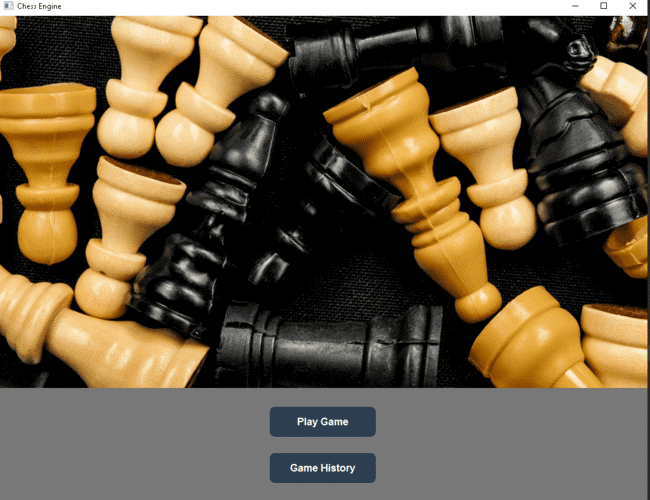 | 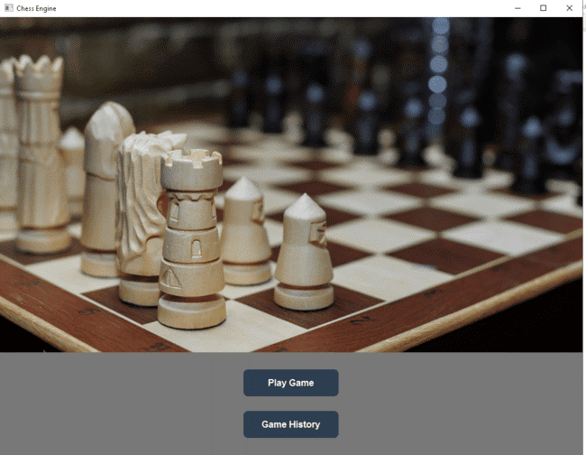 |
|:------------------------------------------------------------:|:------------------------------------------------------------:|
| Main Menu 1st Slide                                        | Main Menu 2nd Slide                                                     |


---

### Game Mode Selection

The game mode dialog features a clean, centered layout:

- **Model as White vs Stockfish** – model plays as white vs Stockfish
- **Model as Black vs Stockfish** – model plays as black vs Stockfish
- **Model as White vs Player** – model plays as white vs the user
- **Model as Black vs Player** – model plays as black vs the user
- **Model vs Model** – model plays against itself
- **Player vs Player** – local 2-player mode

To exit, press `Cancel` or click the 'x' in the top-right corner.

After selecting a mode, it will highlight and a `Start` button will appear. Pressing it opens the game window.

If the selected mode involves Stockfish, a difficulty slider will also appear.

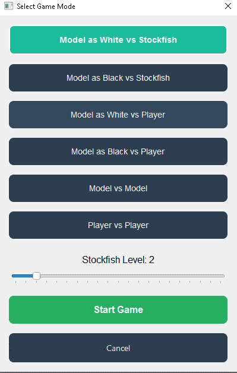

---

### Game Window

Once the game window opens, two interfaces are possible:

#### User Plays  
- Displays the board only.
- The user clicks a piece, then a valid square to move.

#### User as Coordinator  
- Appears when both players are AI/Stockfish.
- Includes two buttons:
  - **Next Move** – executes the next move from the current engine
  - **Auto Play** – toggle button for automatic play with a short delay

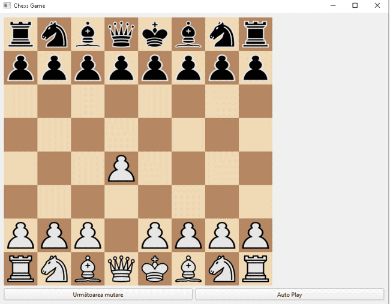

---

## 🧩 In-Game Functionality

### Move a Piece

- Click the desired piece → it will rise slightly and valid squares are highlighted.
- Click the destination to move.

| 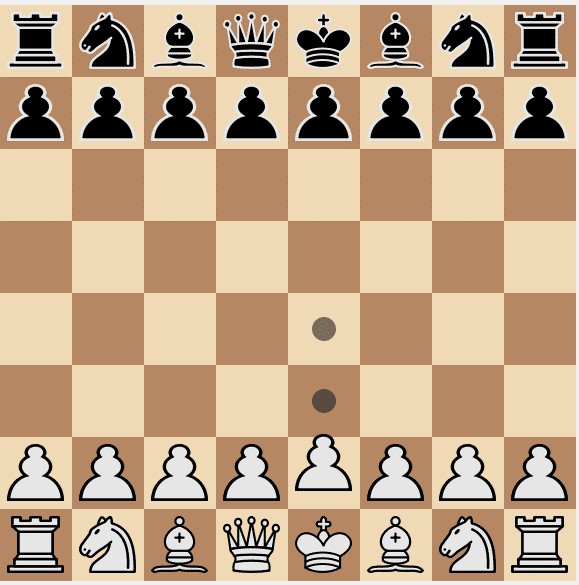 | 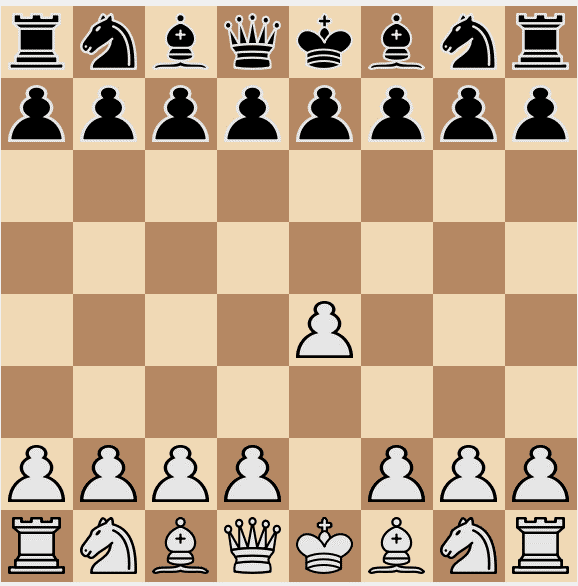 |
|:------------------------------------------------------------:|:------------------------------------------------------------:|
| Piece Selection                                      | Move Made                                                   |

---

### En Passant

- When a pawn moves 2 squares and an enemy pawn is on an adjacent file, an en passant capture is possible on the next move only.

| 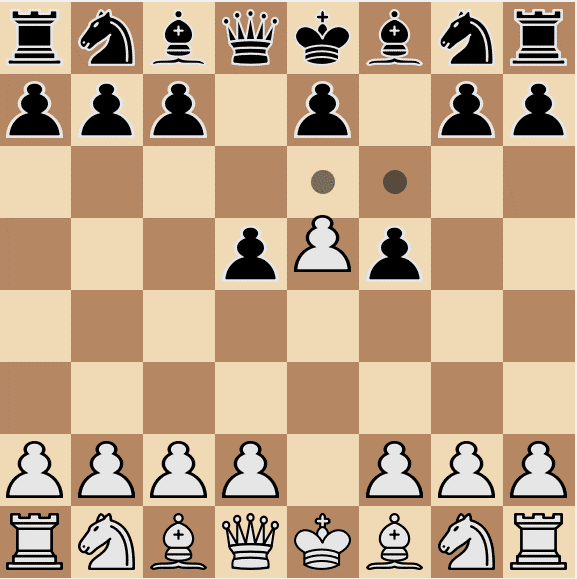 | 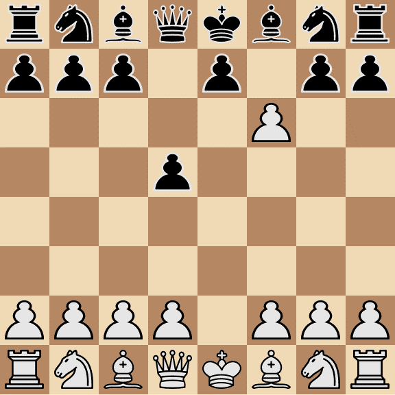 |
|:------------------------------------------------------------:|:------------------------------------------------------------:|
| Before en Passant                       | After en passant                                                |

---

### Check

- If a player is in check, the king’s square is highlighted pink.
- The player can only make legal moves to escape check.

| 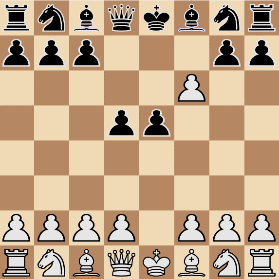 | 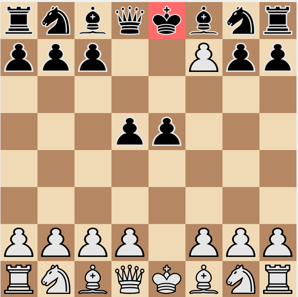 |
|:------------------------------------------------------------:|:------------------------------------------------------------:|
| Before Check                                  | After_Check                                            |

---

### Pawn Promotion

- Upon reaching the 8th rank, a dialog appears prompting to select the piece (queen, rook, bishop, knight).
- The selected piece replaces the pawn.

|  | 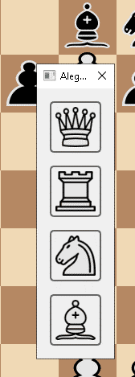 | 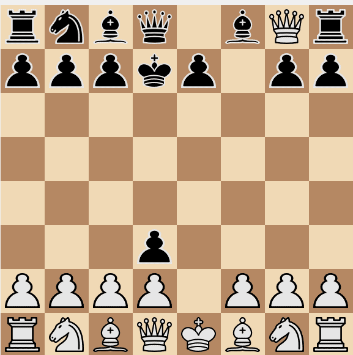 |
|:-------------------------------------------------:|:----------------------------------------------:|:-----------------------------------------------:|
| Before Promotion                             | Promotion Dialog pops up                                   | After Promotion                          |


---

### Castling

- Available if the king and rook haven’t moved, no pieces in between, and the king isn’t in or crossing check.
- Move the king two squares toward the rook to trigger castling.

| 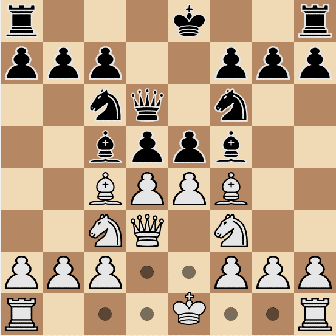 | 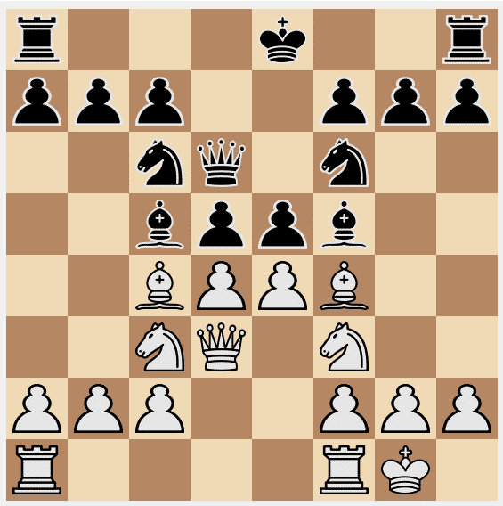 | 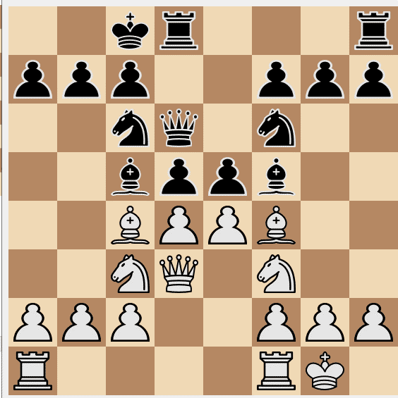 |
|:-------------------------------------------------:|:----------------------------------------------:|:-----------------------------------------------:|
| Before Castling                       |                 Short Castling White                |        Long Castling Black                  |

---

### Checkmate

- If a player is checkmated, a winning message appears.
- No moves are allowed; user can only return to the main menu.

| 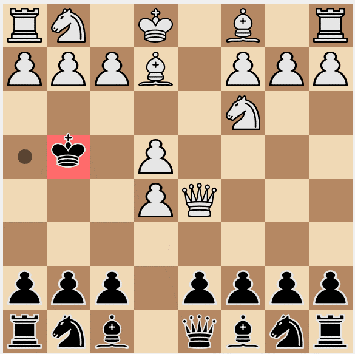 | 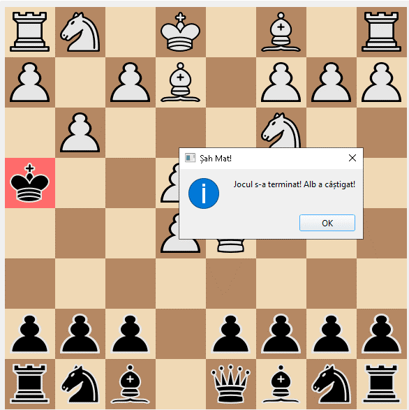 |
|:------------------------------------------------------------:|:------------------------------------------------------------:|
| Before Checkmate                             | After Checkmate                                            |

---

## 📜 Game History Viewer

To analyze past games, click **Game History** from the main menu.

### Layout Overview

#### Left Panel
- `ListView` of saved games showing:
  - Game mode
  - Winner
  - Date and time
- Navigation buttons:
  - ⏩ Forward
  - ⏪ Backward
  - ⏮ Start
  - ⏭ End
  - 🗑 Delete Game

#### Right Panel
- Interactive chessboard to visualize the game
- Evaluation bar indicating positional advantage

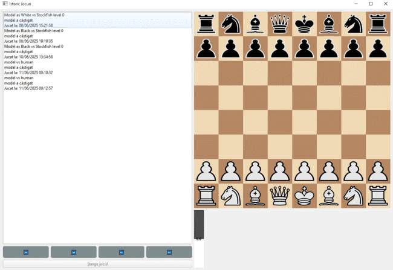

---

### History Navigation

#### Navigate a Game

- Select a game → board resets to the start position.
- Selected game is highlighted in blue.
- Buttons dynamically enable/disable depending on current state.

| 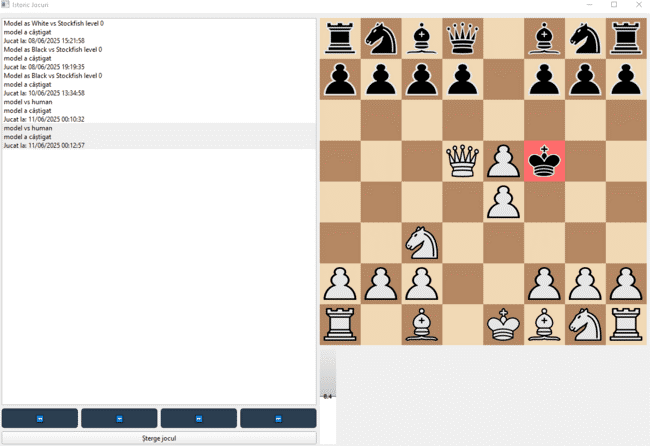 | 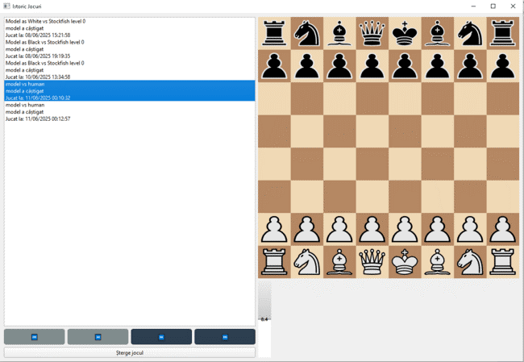 |
|:------------------------------------------------------------:|:------------------------------------------------------------:|
| Going through a game                          | Selecting a different game                                         |

---

#### Delete a Game

- Select a game → press `Delete Game`
- Confirmation dialog appears
- Pressing `Yes` removes the game from the list and JSON file

| 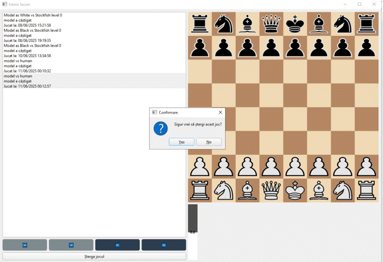 | 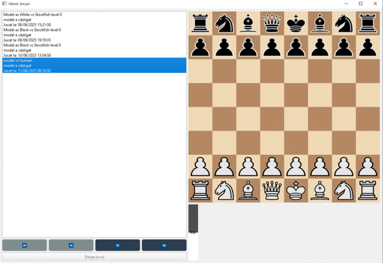 |
|:------------------------------------------------------------:|:------------------------------------------------------------:|
| Pressing Delete Button                        | Confirming Delete                                   |

---


    
